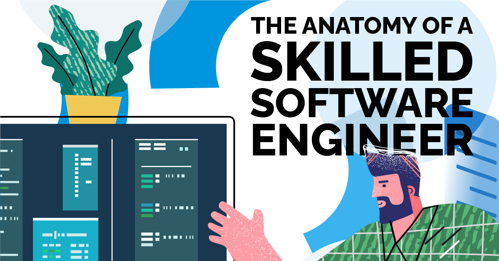

*"Always be a kid - Kobe Bryant"*

To be a successful Software Engineer you have to be a kid. Always be curious, always want to find the answer, and always ask questions. 

## Find A Programming Language! JavaScript?
  I am still relatively new to javascript whereas in the past I've mainly worked with python, C, and C++. My first impression of javascript is that it is a loosely written programming language. When completing the basic javascript freecodecamp problems I noticed how loosely written variables are where data types such as int, char, float, etc don’t need to be explicitly written. However, they use the keywords var, let, and const to declare different types of variables with different purposes. For example, const is used for variables that should never be changed, and let is used for variables that can be changed. Another thing that was new to me was functions and how they can be assigned to variables and treated as variables. Overall, javascript allows for a different style of programming and offers features that other programming languages don't have.

## Understand How You Like to Learn
  Many students have their own method of learning. Some students like sitting in lecture taking notes. Some students like finding external resources or videos to learn off of. However, there is another way of learning and it's called Athletic Software Engineering. Prior to this class, I have never heard of Athletic Software Engineering. From my understanding, Athletic Software Engineering is a very mentally challenging way of learning where we are constantly putting in repetition and practice to apply what we've learned. Though very time-consuming, it is very rewarding as it expects you to put in more hours into work than what you are comfortable with. With this higher time expectancy we are constantly being shown. new experiences and tools that are more real-life applications such as programming, development environment, and project management. Like with sports, there are different types of drills that you do to get better at a specific skill. Similarly, we are applying this to programming where we are constantly being tested so that we constantly improve and through exhaution we are bound to learn.

## Practice! Practice! Practice!
  One of the things that we do to exercise our athletic software engineering learning style is the WOD. The WOD is a timed coding problem where it allows us to practice and prepare for an applicable real-life occurrence such as the coding interview where applicants are also tasked with a coding problem that must be completed within a particular time. I find the WOD very useful because it forces students to prepare for something that is hard to prepare for on their own. From personal experience, I see that there is only a hand full of students that actually prepare for the coding interview. Most students would look at a problem and end up searching for the answer rather than working through the problem and taking their time with it. Then come coding interview time, students tend to blank out and forget everything they "practiced" for. The WODs force us to either test our ability to solve problems or search for the answer where in most cases the answer can’t be found in the given time. Thus, I am excited to tackle on and prepare for the coding interview through these WODs.
