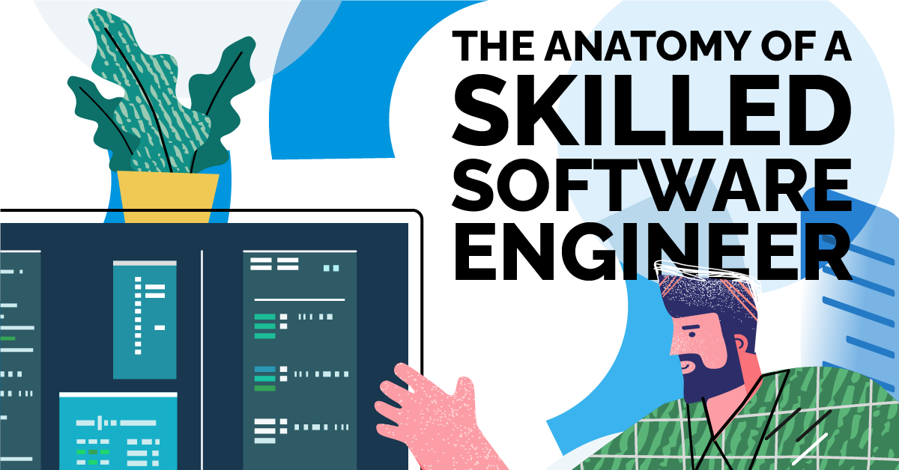

*"Always be a kid - Kobe Bryant"*

To be a successful Software Engineer you have to be a kid. Always be curious, always want to find the answer, and always ask questions. One of these days, maybe the coding interview, you will be asked to get in your bag and showcase your skills as a software engineer.

## A Javascript Interpretation
I am still relatively new to Javascript whereas in the past I've mainly worked with Python, C, and C++. I have never been in a situation where I had the option to choose what language I would like to write in. Previously, I've heard that Javascript and Python are good for front-end development. Nowadays, I hear Python is the way to go. But I've never been in a situation to choose. 
My first impression of javascript is that it is a loosely written programming language meaning, you can get away with some specificity within the code. When completing the basic Javascript freecodecamp problems I came to realize how different each programming language is. For the most part, each programming language can of course solve the same problem but each programming language have its way of telling a story. Specifically, from what I understand Javascript allows for a lot of shortcuts and freedom in coding which can be a good and bad thing. Overall, Javascript has its way of telling a story by offering features that other programming languages don't have.

## Understand How You Like to Learn
 Many students have their methods of learning. Some students like sitting in lectures and taking notes. Some students like finding external resources or videos to learn from. However, there is another way of learning and it's called Athletic Software Engineering. Before this class, I have never heard of Athletic Software Engineering. From my understanding, Athletic Software Engineering is a very mentally challenging way of learning where we are constantly putting in repetition and practice to apply what we've learned. Though very time-consuming, it is very rewarding as it expects you to put in more hours into work than what you are comfortable with. With this higher time expectancy, we are constantly being shown new experiences and tools that are more real-life applications such as programming, development environment, and project management. Like with sports, there are different types of drills that you do to get better at a specific skill. Similarly, we are applying this to programming where we are constantly being tested so that we constantly improve, and through exhaustion, we are bound to learn.

## Practice! Practice! Practice!
 One of the things that we do to exercise our athletic software engineering learning style is the WOD. The WOD is a timed coding problem where it allows us to practice and prepare for an applicable real-life occurrence such as the coding interview where applicants are also tasked with a coding problem that must be completed within a particular time. I find the WOD very useful because it forces students to prepare for something hard to prepare for on their own. From personal experience, I see that there is only a hand full of students that prepare for the coding interview. Most students would look at a problem and end up searching for the answer rather than working through the problem and taking their time with it. Then come coding interview time, students tend to blank out and forget everything they "practiced" for. The WODs force us to either test our ability to solve problems or search for the answer where in most cases the answer can’t be found in the given time. Thus, I am excited to tackle on and prepare for the coding interview through 

