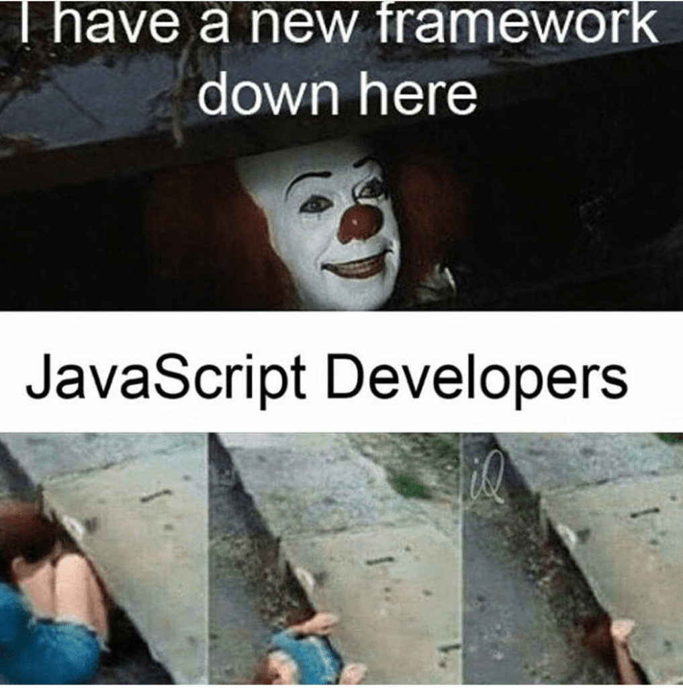

## Why A Framework
Before this class, I never had a full understanding of what a framework even was. Whenever I asked my peers I would always get the response, "It's used to give you something similar to functions that you can work off of." Though it was true and it made sense, I still needed a better understanding of what a framework was. In this class, I understood that frameworks are like shortcuts, and it helps simplify and ease the stress of a person who codes. Specifically, in this class, we used Bootstrap 5 as a framework and with this, a lot of classes were premade. This eased the previous tasks of creating a website while using raw html and css. For instance, we had to develop the grid classes, rows, and columns, in html and css, but in Bootstrap it was already premade and all we had to do was call the class. All in all, frameworks are used to speed up productivity in software development.

## Learning Curve
Though frameworks are very useful and can be used to improve code productivity, there is a learning curve to them as we are using premade classes. The difficulty in this is because the classes are premade and we don't quite understand the properties that are on those classes. With this, there's a lot of time that needs to go into understanding the many classes that are given in the documentation. Within these classes as well there are other classes that you can use to apply that to the column. When I first dived into Bootstrap, it felt like I was in an endless stream of looking at the documentation. This may have to do with my lack of experience with html and css, but I did have to search up a lot of things about Bootstrap and how to do certain things. For example, given tasks of creating websites by using Bootstrap, I had a hard time debugging things and I ended up, what felt like, hard coding things. In conclusion, going through the learning curve of understanding a framework is very useful as it allows for many shortcuts in your development.

