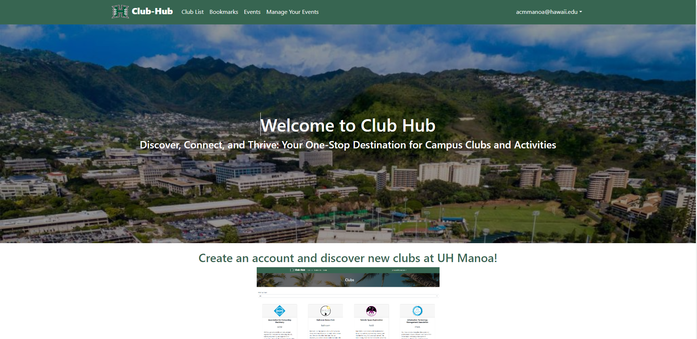
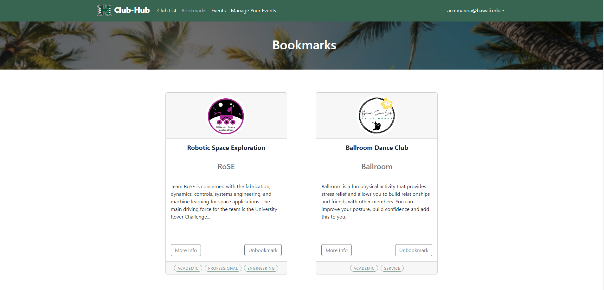
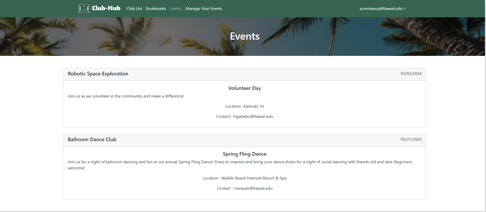
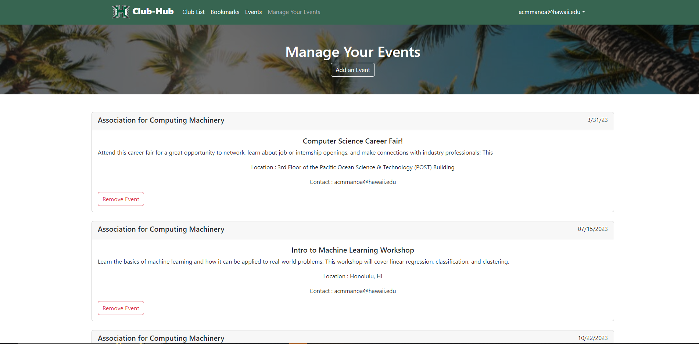

## About the Project
Club Hub is a place where students are able to view all of the clubs around the University Of Hawaii campus and stay up to date with club events by bookmarking their favorite clubs. Students are also able to post their own clubs as well as publish their own events reguarding their club.

 
 
 
 

## Contrtibutions
For this project, I was paired with Maxwell Pauly, Danny Luu, Liliana Royer, and Cash Baker. Our team practiced agile software development to complete our goal of a fully functioning club hub website. In order for our team to succeed, I implemented the dynamic population of the club lists page, and events page, as well as the full functionality of the manage your events page. For the club lists page, with each club in the club collection, I populated a card that read through some of the properties of each club. The events page also collected data from the ProfileClubs collection which is a collection made by each user that populates from the clubs that the user bookmarks. To make this function, I filtered out all of the events by the club name property given from the ProfileClubs collection. With this, I populated the page with event cards consisting of properties of the events. Finally, I created a manage your events page where you are able to see a full events page consisting of events that the user logged in owns. For example, the user, acmmanoa@hawaii.edu, is able to manage all of the events regarding acmmanoa@hawaii.edu. 

## Takeaways
During my time completing this project, I found that project management is very important. I believe that the use of agile software development allowed my team to succeed. However, we were able to see a side effect of agile software development which was exhaustion. Though my team was very ambitious with tasks, where we met most of the M2 Milestone requirements during the M1 Milestone, towards the end completing tasks in a timely matter became difficult. Many of the tasks were completed a few days before the deadline. In the end, my team was successful in creating a fully functional web application and it was a great experience to work in a fast pace environment. 

The Project Page can be found at [https://mongo-mongoers.github.io](https://mongo-mongoers.github.io/). 
The GitHub Repository can be found [here](https://github.com/mongo-mongoers/club-hub).
