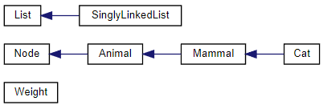

<div class="text-center p-4">
  
  
</div>
The Animal Farm labs were given in the EE205 Object-Oriented Programming course given at the University of Hawaii at Manoa, taught by Professor Mark Nelson. These labs were written in C and C++ and the intentions of the labs were to create a database where with each lab we are introduced to and asked to implement new aspects of Object-Oriented Programming. Initially, it started off with storing our objects and their properties in an array, then structs, then eventually linked lists. When our objects were stored in the linked list we were tasked with adding a more intriguing hierarchy, hence Animal Farm. Evidently, our database was structured so that our database would contain a class hierarchy of animals. The core of this database has implemented CRUD (Create, Read, Update, Delete) where these objects were nodes and those operations could be applied to those nodes.

These abundances of labs were very difficult, especially with having very little experience in coding, because of the size of the labs and new content that I was handed. Though, I learned the most about programming through the hardships of this lab. The main takeaways I got out of this project are class hierarchy, inheritance, pointers, singly and doubly linked-list, and that there are no classes in C.

Here is some code that comes from the header file of my Animal Class where you will see implementations of  getters and setters, constructors, inheritance, etc:

```cpp
class Animal: public Node{
public:
    static const std::string KINGDOM_NAME;
private:
    std::string species;
    std::string classification;
    Gender gender = Gender::UNKNOWN_GENDER;
    Weight weight;
public:///constructors///
    Animal(const Weight::t_weight newMaxWeight,
           const std::string &newClassification,
           const std::string &newSpecies);

    Animal(const Gender newGender,
           const Weight::t_weight newWeight,
           const Weight::t_weight newMaxWeight,
           const std::string &newClassification,
           const std::string &newSpecies);
public:///getters and setters///
    std::string getKingdom() const noexcept;
    std::string getClassification() const noexcept;
    std::string getSpecies() const noexcept;
    Gender getGender() const noexcept;
    Weight::t_weight getWeight()const noexcept;
    void setWeight(const Weight::t_weight newWeight);
public:///public methods///
    virtual std::string speak()const noexcept=0;
    void dump() const noexcept override;
    bool validate() const noexcept override;
    ////static public methods///
    static bool validateClassification(const std::string &checkClassification) noexcept;
    static bool validateSpecies(const std::string &checkSpecies) noexcept;
protected:///protected method///
    void setGender(const Gender newGender);
};
```
