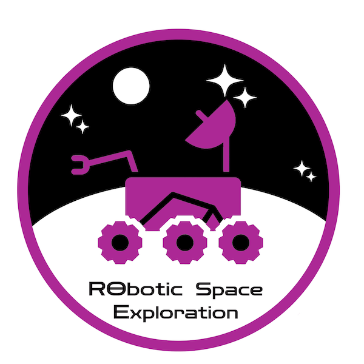

VIP Team RoSE competes in the URC(University Rover Challenge) which is a robotics competition where teams are expected to design an Autonomous Mars Rover in order to complete specific tasks mimicking space exploration. These tasks include a science mission, extreme delivery mission, equipment servicing mission, and autonomous navigation mission. In order to compete, we must pass the PDR(Preliminary Design Review) and SAR(System Acceptance Review) so that the URC could validate that we are able to compete with the other teams.

I am the Arm Software Lead which is a subteam of the subsystem GNC(Guidance, Navigation, and Control). During my time here I was asked to implement a joystick-teleoperated arm software so that the arm could complete numerous tasks such as pulling and picking up objects and typing on the keyboard. Specifically, I am in charge of providing the arm software to complete the equipment servicing mission. With this, the mechanical subsystem provides me with an arm design and I am responsible for simulating the arm using a URDF(Unified Robot Description Format) and implementing the arm controls using ROS.

Here is an image of the arm simulation:

